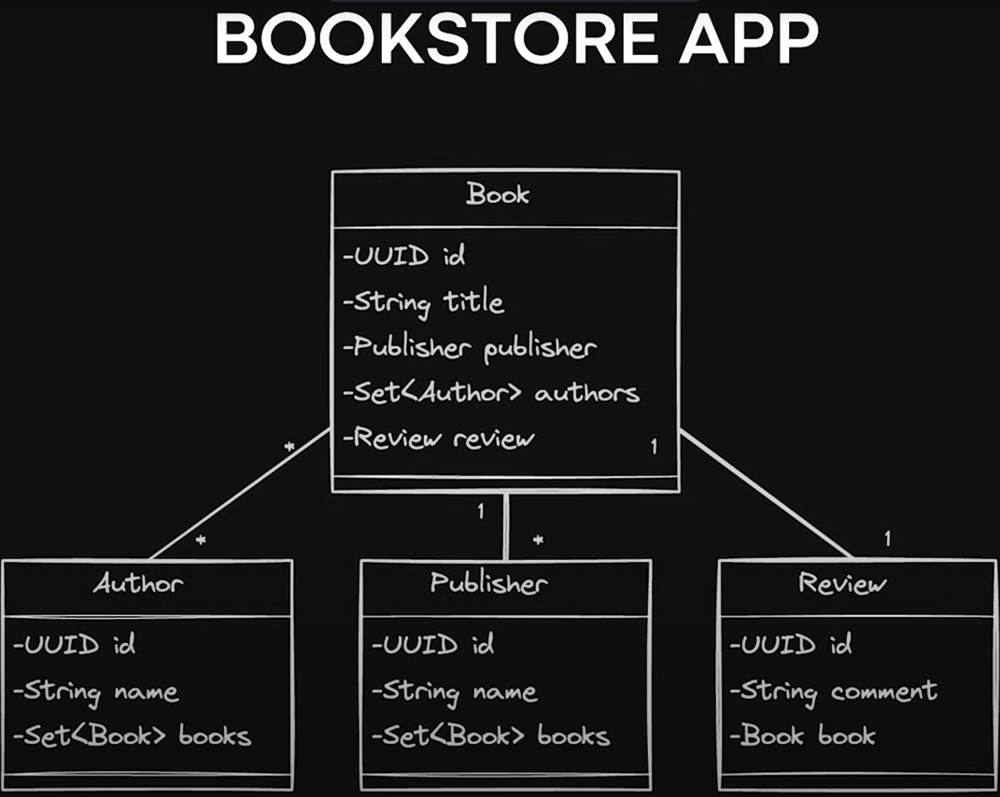

# SPRING DATA JPA - 2024
Destancando-se que este repositório está focado na visualização destes códigos no Postman/Postgres.
Este repositório não está focado numa criação de API.

## JPA

### O que é?

Java Persistense API, é um projeto que faz parte do ecossistema spring para trabalharmos com base de dados nas nossas aplicações Spring de uma forma muito mais fácil.

É também considerado uma especificação para mepeamento objeto relacional em Java. Mapeamento seja de entidades, transformando tudo isso em tabelas e colunas na base de dados.

Faremos isso usando anotações, consultas JPQL e Apis para realizar a interação com a base de dados.

O JPA, portanto, é uma abstração.

Bom, se o JPA é uma abstração, quem irá implementá-lo?

**Entramos na camada de Hibernate!**
<hr>

## Hibernate

### O que é?

Ele irá utilizar por debaixo dos panos do JDBC, para realizar essas transações com a base de dados. Para que seja possível iniciar as conexão, executar querys/transações, etc...
<hr>

## Spring Data JPA

Ele basicamente engloba o JPA. É uma camada de abstração inicial, que inclui os recursos do JPA e também alguns recursos extras (próprios), como implementação do padrão de repositories, criação de consulta na base a partir de nome de atributos (usando métodos findAll, findById, entre outros).

A aplicação Spring irá nos permitir utilizar deste projeto com bancos relacionais (postgres por exemplo) não precisando ficar criando/executando na mão scripts SQL, focando mais nas regras de negócios.
<hr>

## PROJETO

### UML do Projeto

<hr>

### Conexão com o Banco de Dados

Dentro de application.properties, colocamos os dados de conexão com o postgres.
<hr>

### Mapeando Entidade JPA
1. Criar pacote models e Classes;
<hr>

#### CLASSE BOOKMODEL [Veja aqui](https://github.com/zenonxd/spring-data-jpa-2024/blob/main/src/main/java/com/bookstore/jpa/models/BookModel.java)
- Passar @Entity
- Criar a tabela com @Table

Teremos **dois atributos iniciais**: id e title;

ID: 
- Passamos @ID e automaticamente ele vai ser a chave primária da tabela.
- Passamos @GeneratedValue para definir como o id será gerado. Neste caso, será **AUTO**.

Title:

- Passaremos **@Column**. Dentro desssa anotação, podemos inserir certas regras, como:
**(nullable = false, unique = true)**.

Criar agora Getters e Setters.
<hr>

#### CLASSE PUBLISHERMODEL [Veja aqui](https://github.com/zenonxd/spring-data-jpa-2024/blob/main/src/main/java/com/bookstore/jpa/models/PublisherModel.java)
- Fazer os mesmos passos da classe acima (mapeamento com Entity, Table, Id, etc...)

<hr>

#### CLASSE AUTHORMODEL [Veja aqui](https://github.com/zenonxd/spring-data-jpa-2024/blob/main/src/main/java/com/bookstore/jpa/models/AuthorModel.java)
- Fazer os mesmos passos da classe acima (mapeamento com Entity, Table, Id, etc...)
<hr>

#### CLASSE REVIEWMODEL [Veja aqui](https://github.com/zenonxd/spring-data-jpa-2024/blob/main/src/main/java/com/bookstore/jpa/models/ReviewModel.java)
- Fazer os mesmos passos da classe acima (mapeamento com Entity, Table, Id, etc...)
<hr>

## MAPEAMENTO ENTRE ENTIDADES - RELACIONAMENTO BIDIMENSIONAL (OneToMany, etc)
Cada livro, possui uma editora.

Mas uma editora (publisher), pode ter publicado vários livros.

### ManyToOne [Veja aqui](https://github.com/zenonxd/spring-data-jpa-2024/blob/a2693de36d9ede5d63456aa52b0398b517874015/src/main/java/com/bookstore/jpa/models/BookModel.java#L23)
Na classe BookModel, importaremos o objeto Publisher e passaremos as seguintes anotações:
- ManyToOne - Pois como dito acima, um book só terá um publisher;
- JoinColumn - Criaremos uma coluna a mais, com a chave estrangeira "publisher_id". Essa coluna terá ligação a entidade Publisher.


### OneToMany [Veja aqui](https://github.com/zenonxd/spring-data-jpa-2024/blob/a2693de36d9ede5d63456aa52b0398b517874015/src/main/java/com/bookstore/jpa/models/PublisherModel.java#L21)
Na classe PublisherModel, importamos a coleção (set) de Books e passaremos as anotações.
- ManyToOne - Pois são várias editoras, para um só livro.
  - Passaremos o mappedBy = "publisher"
  - fetch = FetchType.Lazy.

- @JsonProperty - Imagine que um cliente vai solicitar via API alguns detalhes de uma determinada Publisher. Ele vai esperar por uma coleção (set) de livros,
mas, como o nosso carregamento está Lazy, muitas vezes essa coleção não estará disponível.

  Então, passamos ```(access = JsonProperty.Access.WRITE_ONLY)``` e não dará nenhum erro de serialização na leitura.

O mappedBy nada mais é do que o nome da importação na outra classe. Se vermos na classe BookModel a classe PublisherModel foi importada com a variável **publisher**.

O fetch como Lazy define um carregamento mais lento e só será feito também quando necessário.

Se fosse um EAGER, ele sempre buscaria a editora (publisher) na base de dados e também carregaria tudo automaticamente, **trazendo cada um dos livros que fazem parte da editora**, podento gerar até mesmo **loops**.

Isso não é sempre necessário, portanto, o Lazy é o mais adequado.

Isso irá nos permitir então buscar, por exemplo, um livro que pertence a uma editora específica, pois o mapeamento foi feito. 
<hr>

### ManyToMany 
Será feito na tabela author e book, pois, um livro pode ter mais de um autor e um autor pode ter mais de um livro.

Um livro terá uma coleção de autores. 
Autores terá uma coleção de livros.

**Na classe BookModel** [Veja aqui](https://github.com/zenonxd/spring-data-jpa-2024/blob/a2693de36d9ede5d63456aa52b0398b517874015/src/main/java/com/bookstore/jpa/models/BookModel.java#L25)
- Importaremos um Set de AuthorModel.
- Passaremos anotação @ManyToMany

Dessa vez, não será JoinColumn, pois teremos uma coleção de ambos os lados.

Usaremos @JoinTable, (tabela auxiliar), que vai unir os ID's das suas entidades. Dentro do JoinTable, daremos alguns comandos:
- name = "nome da tabela auxiliar"
- joinColumns = @JoinColumn(name = "book_id") > chave primária
- inverseJoinColumns = @JoinColumn(name = "author_id") > chave estrangeira

**Na classe AuthorModel** [Veja aqui](https://github.com/zenonxd/spring-data-jpa-2024/blob/a2693de36d9ede5d63456aa52b0398b517874015/src/main/java/com/bookstore/jpa/models/AuthorModel.java#L22)
- Importaremos um Set de BookModel
- Passaremos anotação @ManyToMany

E aplicaremos o relacionamento. Dentro de @ManyToManny, passaremos o mappedBy novamente.
E aí, é o que já sabemos. Como o Author foi importado na classe? Como "authors" (dono desse relacionamento). Portanto, o mappedBy terá justamente esse nome associado a ele.


### OneToOne
Um livro vai ter uma resenha (resumo). Uma resenha (resumo) será para um livro. Um para um.
Ele não pode ter dois resumos.

**Com essa implementação, sempre que buscarmos um livro (BookModel) ele vai trazer os relacionamentos um pra um. (Padrão FecthType.EAGER - ansioso).**


**Na classe ReviewModel** [Veja aqui]()
- Importaremos o Book;
  - Dessa vez, não será um Set pois será somente **um livro**;
  - @JsonProperty com write only evitando erro na serialização;
  - Anotação OneToOne;
  - Passa também @JoinColumn = "book_id";
    - Essa coluna com essa chave estrangeira relacionará a qual livro esse Review pertece.


**Na classe BookModel** [Veja aqui]()
- Importaremos o review;
  - Passa a anotação OneToOne; 
  - Ele será mappedBy "books". Nome da variável na classe **Review**;
  - E também tera o parâmetro cascade = Type.ALL;

#### Sobre CascadeType

Assim que criamos um Review e atribuímos ele dentro de book, ele será salvo como uma cascata de transações.

Sempre que fizermos determinadas transações na base de dados com relação a esses relacionamentos,
se for o Book, por exemplo, ele será replicado para os relacionamentos que estiverem considerando essa "cascata".
    
Caso a gente salve um livro (bookmodel) poderemos passar simultaneamente, de forma interna (sem save), um review. 

**Outra situação é se fossemos deletar um determinado Book. Se fizermos isso, com o CascadeTypeAll, ele também deleterá o review desse livro.**

Mas o mais interessante é fazermos essas operações (deleção/salvamento) de forma customizada.


<hr>

## Repositories
Aqui faremos de fato o uso do Spring Data JPA e as suas facilidades. 

Primeiro, criaremos um packate repositories.

Criaremos dentro desse packate uma interface BookRepository. Ela automaticamente será um Bean do Spring (como se usássemos o @Repository).

### Por que criar essa interface?
Bom, ela será feita exclusivamente para fazermos o extends JpaRepository. Dentro dele, passamos: <EntidadeUtilizada, Identificação>

Aqui teremos métodos de save, delete, findById....

Mas também teremos outros recursos, por exemplo: Se quisermos encontrar um livro pelo nome de um título, é muito simples!

Não precisa de forma alguma escrever um “script” SQL. O próprio JPA nos permite trabalhar com métodos a partir de nomes de atributos :) [Veja aqui]()

Podemos também procurar livros pela ID do Publisher. Neste caso, como são mais de um, o método retornará uma lista. **Passamos o @Query com o select que quisermos.** [Veja aqui]()

### Método save() e @Transactional


<hr>


<hr>

## ANOTAÇÕES JPA

- @Table(name = "TB_BOOK") -
Dá o nome a uma tabela a ser criada.
